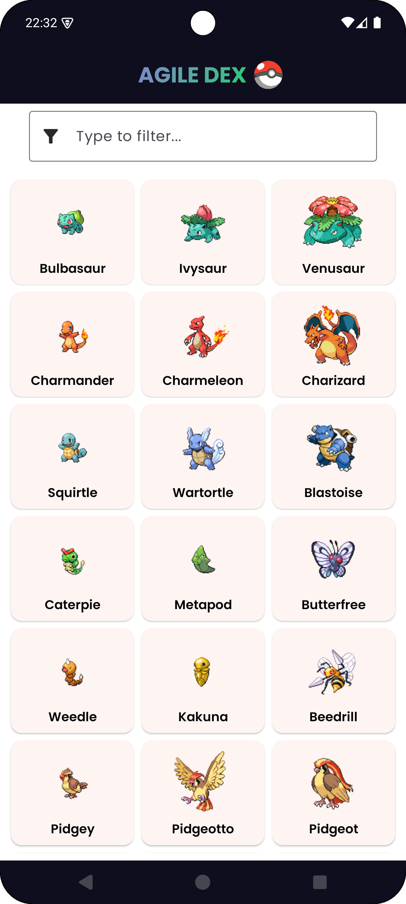
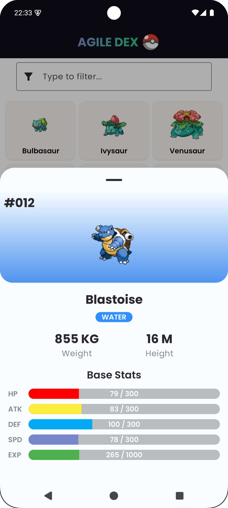
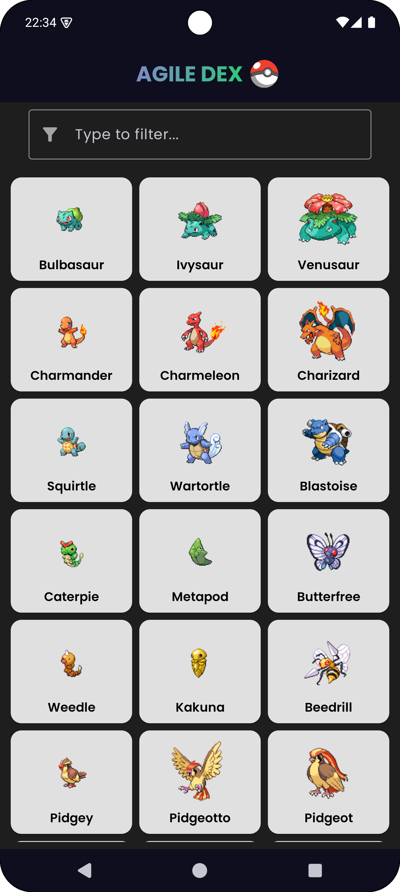
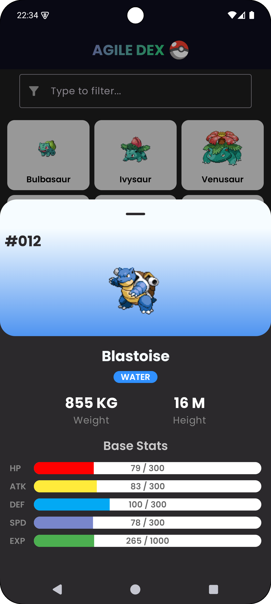
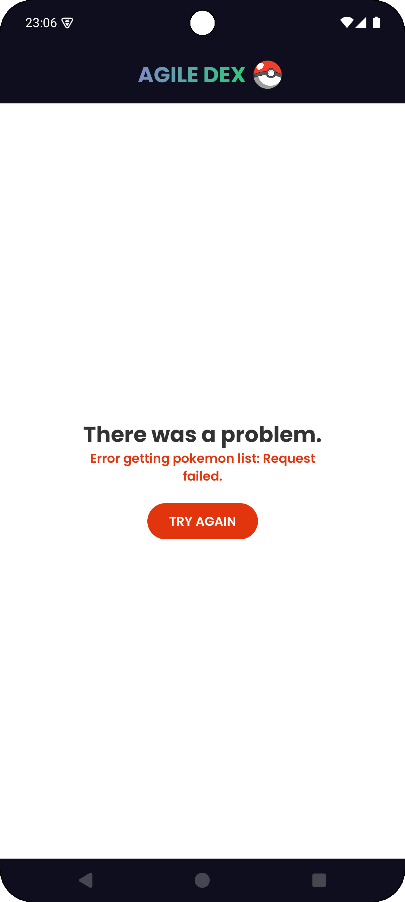
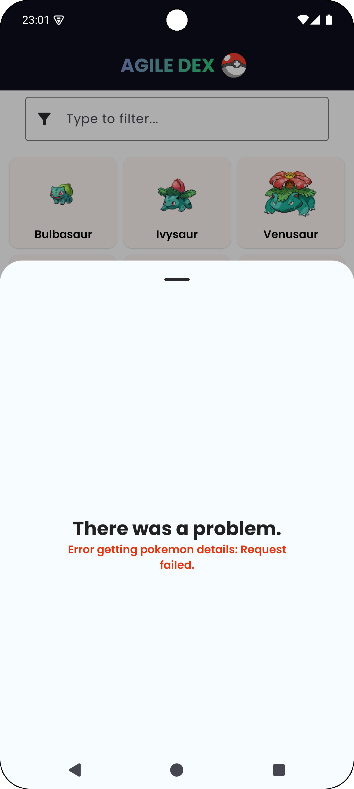
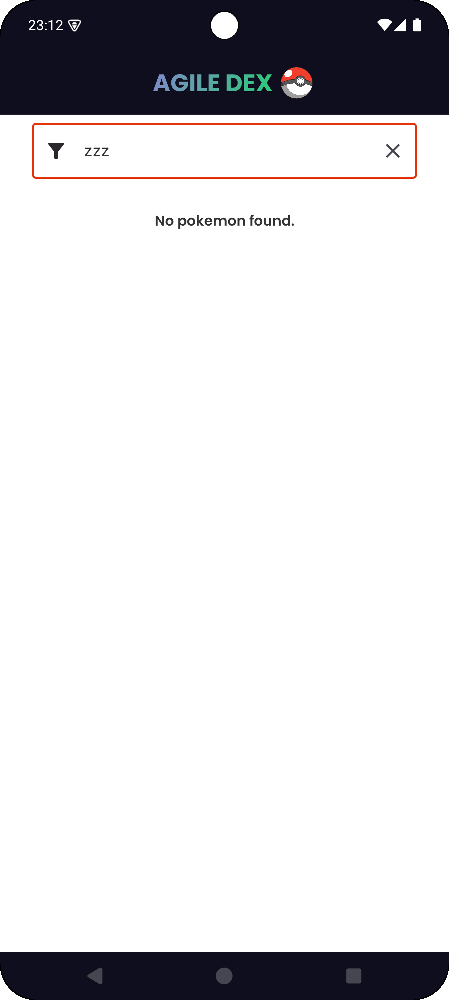

<h1 align="center">
  <p align="center">Agile Dex</p>

## 💻 Project

AgileDex is an Android application that allows users to explore the world of Pokémon. The app
retrieves data from the [PokéAPI](https://pokeapi.co/) and provides a paginated list of Pokémon with
their basic details. Users can browse, filter, and check more detailed information about each
Pokémon, including an image and various attributes.

<div align="center">
    <table>
      <tr>
        <td>
          
        </td>
        <td>
          
        </td>
<td>
          
        </td>
        <td>
          
        </td>
      </tr>
<tr>
        <td>
          
        </td>
        <td>
          
        </td>
<td>
          
        </td>
        <td>
          
        </td>
      </tr>
<tr>
    </table>

</div>
<br/>

</h1>

## 🚀 Features

- **List of Pokémon:** Displays up to 300 Pokémon with their order and names;
- **Pagination:** Implements infinite scrolling to fetch more Pokémon from the API;
- **Search:** Allows filtering the list by pokémon name;
- **Detail Screen:** Shows additional information and an image of the selected Pokémon;
- **Error Handling:** Handles API failures gracefully.
- **UI Mode:** Supports Light and Dark theme.

## 🎯 Future Improvements

- **Improve network data cache:** Handle internet data caching via room database and if necessary
  save some data in sharedpreferences;
- **UI:** Improve UI with animations and trasitions;
- **Tests:** Write more tests to make the app more reliable;
- **General Review**: Make a complete review and small improvements;

## 🛠️ Development

The application was developed for the Android platform using the following technologies and tools:

- `IDE: Android Studio;`
- `Language: Kotlin`
- `Architecture: MVVM with Clean Architecure principles`
- `UI: Jetpack Compose;`
- `Dependency Injection: Hilt;`
- `Testing: JUnit, Mockito, Truth, Turbine;`

## 💿 Installation

1. Clone this repository:

```bash
git clone https://github.com/WallaceMartinsTI/AgileDex.git
```

2. Open the project in Android Studio.

4. Build and run the application on an emulator or physical device.

## 🧾 Final Notes

The app has been tested on the following devices:

- Xiaomi Redmi Note 13 (Physical Device)
- Pixel 8 Pro (AVD - Android Virtual Device | Android API 35 x86_64)

Developing AgileDex helped me gain more experience with API consumption, dealing with theme
differences and my overall development skills. I was pleased with the result achieved and I want to
implement future improvements as soon as possible.

<br />
